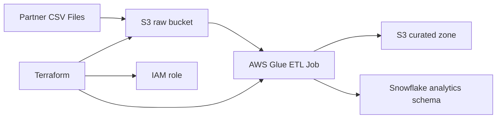

# AWS Glue Terraform Snowflake Platform

Cross-cloud data engineering project that provisions AWS infrastructure with Terraform, transforms partner sales data in Glue, and prepares curated output for Snowflake analytics.

## Business Scenario
A commercial operations team receives daily reseller files from several partners. The platform must ingest those files into S3, standardize them with Glue, and push trusted daily sales aggregates into Snowflake for finance reporting.

## Tech Stack
- AWS S3
- AWS Glue
- AWS IAM
- Terraform
- Snowflake
- PySpark

## Architecture


## Repository Layout
```text
terraform/main.tf
glue/jobs/partner_sales_etl.py
sample-data/partner_sales.csv
snowflake/schema.sql
```

## Example Output
| partner_id | country | sale_date | daily_sales_amount |
| --- | --- | --- | ---: |
| PT001 | UK | 2026-04-18 | 18500.00 |
| PT002 | DE | 2026-04-18 | 13200.00 |
| PT003 | FR | 2026-04-19 | 9100.00 |

## What This Demonstrates
- Infrastructure as code for a data platform
- IAM-aware Glue job provisioning
- Cross-cloud handoff from AWS processing into Snowflake
- Clear business use case tied to finance and channel reporting

## How To Demo
1. Run `terraform init` and `terraform apply`.
2. Upload the sample CSV into the raw S3 path.
3. Trigger the Glue job from the console or job scheduler.
4. Run the Snowflake DDL and load the curated parquet output into the target table.
